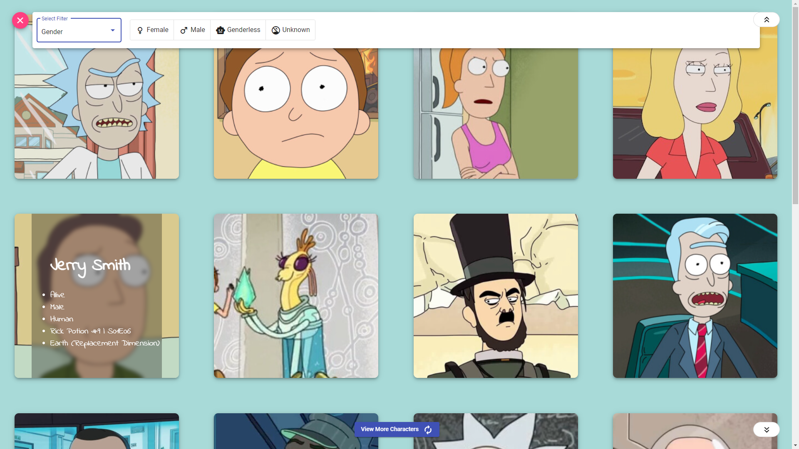
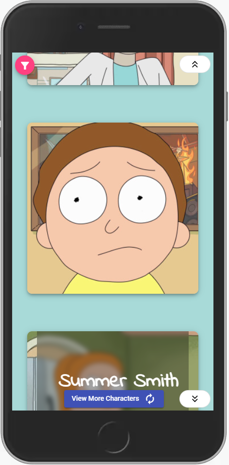
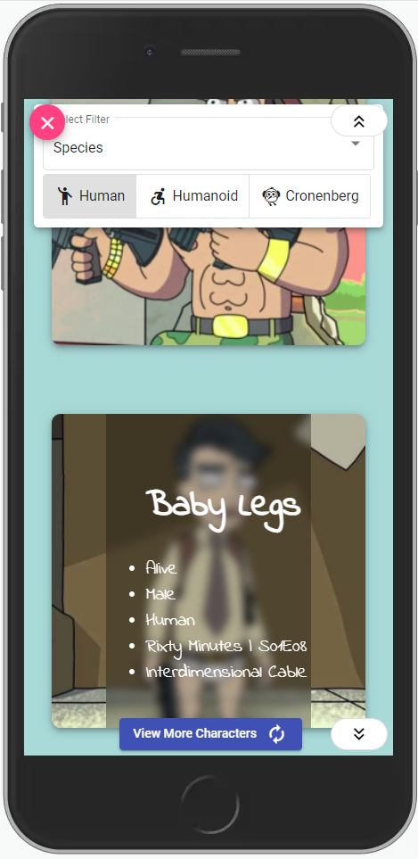

# [**Rick & Morty**](https://rickmorty-shivam.web.app/)
## [**Rick and Morty Catalogue**](https://rickmorty-shivam.web.app/)
Find all your favourite characters of R & M here !!

Filter the character by
- Name
- Gender : Male, Female, Genderless, Unknown
- Species  : Human, Humanoid, Cronenberg

### Responsive web app

This project was generated with [Angular CLI](https://github.com/angular/angular-cli) version 11.0.4.
## Screen-shots
 
|                                                |                                                |
| ---------------------------------------------- | ---------------------------------------------- |
|  |  |

## [**API** :  https://rickandmortyapi.com/api](https://rickandmortyapi.com/documentation)

## Deploy 

Run `firebase deploy` to deploy app on firebase.
## Build

Run `ng build --prod --aot` to build the project. The build artifacts will be stored in the `dist/` directory. Use the `--prod` flag for a production build.

## Developer
- [**Shivam Gaur**](https://github.com/shivam101gaur/My-Profile#readme)
